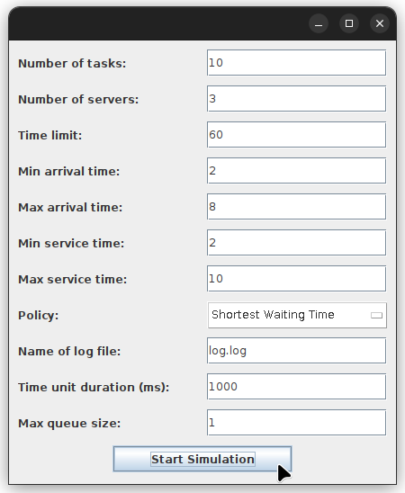
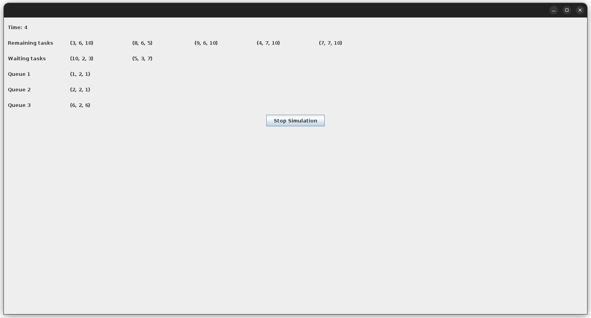

# Queue Management

## Description

An application that simulates queuing-based systems. It involves clients
arriving, joining queues, waiting, getting served, and leaving. The application
calculates key metrics such as average waiting time, average service time, and
peak hour.

## Screenshots

### Choosing the settings of the simulation



### Simulation



## Getting Started

### Prerequisites

- maven

  Debian/Ubuntu:

  ```sh
  sudo apt install maven
  ```

- java 17 jdk

  Debian/Ubuntu:

  ```sh
  sudo apt install openjdk-17-jdk openjdk-17-jre
  ```

### Installation

1. Clone the repo

   ```sh
   git clone https://github.com/CozmaRares/queue-management.git
   cd queue-management
   ```

2. Compile the code

   ```sh
   mvn compile
   ```

3. Run the code

   ```sh
   mvn exec:java
   ```

## Design

**_Design Pattern - MVC:_**

The project adheres to the Model-View-Controller (MVC) architectural pattern, a
structured approach that separates the application into three distinct
components: Model, View, and Controller.

### Model

1. **Data Classes:** The Data portion of the model comprises two essential classes:

   - _Task_: Represents individual tasks or clients in the queuing system, each
     requiring a specified amount of time for processing.
   - _SimulationFrame_: Stores the state of each frame in the simulation,
     facilitating the tracking of system dynamics over time.

2. **Strategy:** The Strategy component introduces flexibility into the system
   by offering two strategies for assigning clients (tasks) to queues (servers).
   These strategies are:

   - _Shortest Queue_: Assigns tasks to the queue with the fewest clients waiting.
   - _Shortest Waiting Time_: Assigns tasks to the queue where clients are
     expected to wait the least.

3. **Logic Classes:**
   - _SimulationManager class_: This integral class manages the entire queuing
     simulation. It handles the arrival and processing of tasks over a specified
     time period, calculates critical metrics like waiting time and peak hour, and
     updates the system state as time progresses.
   - _Scheduler class_: Responsible for partitioning each task to an appropriate
     server based on the selected strategy.
   - _Server class_: Manages the execution of each task within the designated queue.

### View

- _SetupView_: Provides an interface for users to input the simulation settings.
  [^settings]
- _SimulationView_: Offers a visual representation of the queuing simulation by
  displaying received SimulationFrames.

### Controller

The Controller component connects the GUI and the underlying logic. It adds
functionality to the views, allowing users to interact with the simulation and
configure its parameters as needed.

## Reflection

The Queue Management Project was developed as a college assignment within the
Fundamental Programming Techniques class. The assignment's primary objective was
to design and implement an application capable of simulating queuing-based
systems. This simulation involved the arrival of N clients for service, their
entry into Q queues, waiting, being served, and ultimately leaving the queues.
The application was tasked with computing essential metrics, including average
waiting time, average service time, and identifying the peak hour of system activity.

The trickiest part of the project was making the multithreading work smoothly. I
came up with a bit of a hack using Thread.sleep, but it caused a few hiccups
with the Server's task queue that took quite a bit of time to resolve.

The project employed Java as the main language, Maven for project management,
Java Swing for the user interface, and tackled multithreading for task handling.

[^settings]:
    If the queue size is set to -1, the queues will be treated as having no maximum size and
    will accept all available tasks.
