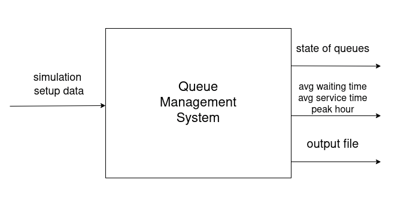
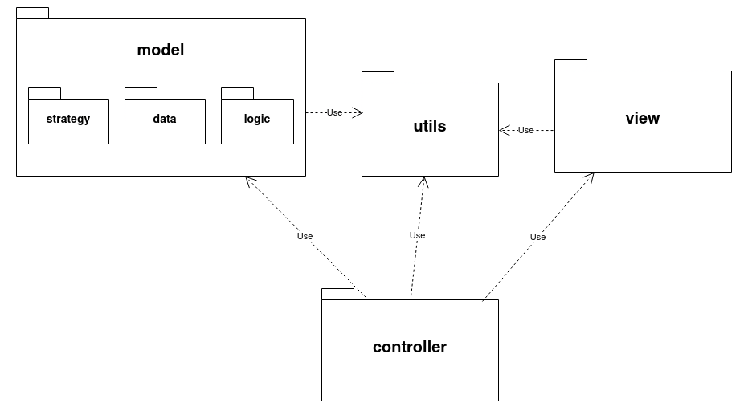
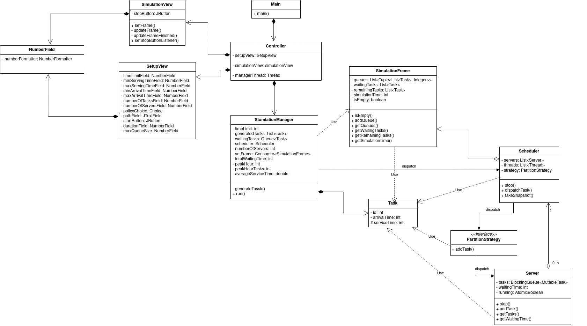

# Assignment 1 - Polynomial Calculator

## 1. Assignment Objective

Design and implement an application aiming to analyze queuing-based systems by (1) simulating a
series of N clients arriving for service, entering Q queues, waiting, being served and finally leaving the
queues, and (2) computing the average waiting time, average service time and peak hour.

## 2. Problem Analysis

### Functional Requirements

* The application should allow users to setup the simulation
* The application should allow users to start the simulation
* The application should allow users to stop the simulation
* The application should display the real-time queues
evolution
* The application should log the events of the simulation in a file

### Use Case

__Use Case:__ Simulation Setup \
__Primary Actor:__ user \
__Main Success Scenario:__

1. The user changes the default setting of the simulation
2. The user clicks on the _Start Simulation_ button

__Use Case:__ Simulation \
__Primary Actor:__ user \
__Main Success Scenario:__

1. The application displays the real-time evolution of the queues
2. The user can go back to the setup step by clicking on the _Stop Simulation_ button

## 3. Design

### Level 1: Overall System Design

### Level 2: Package Diagram

### Level 3: Class Diagram

## 4. Implementation

### Controller

The __Controller__ is responsible for creating the views, adding their event listeners and setting their visibilities based on the state of the application. This class is also responsible for creating the _SimulationManager_ and opening/closing the output file.

### GUI

Both view classes (_SetupView_ and _SimulationView_) use a (handmade) grid layout.

__SetupView__ contains various fields that represent the settings of the simulation.

__SimulationView__ receives a _SimulationFrame_ and displays it.

### Data Classes

__Task__ contains the relevant information about the task, i.e. the unique ID, arrival time and service time.

__SimulationFrame__ contains the relevant information about the simulation, i.e. the state of the queues, waiting tasks (tasks that have an arrival time less than the simulation's current time but have not been sent to a server) and remaining tasks (tasks that have not yet arrived).

### Partition Strategy

__PartitionStrategy__ is an interface that defines the structure of a strategy used to partition the tasks to the servers. It defines the _addTask_ method that receives the task and servers to choose from. The dispatching of a task could fail if the queues are full. The maximum queue size could be set to -1 meaning that the queue size is unlimited (ignoring physical limitations).

__ShortestQueueStrategy__ defines the strategy for assigning a task to the server that has the least amount of tasks to be processed.

__ShortestTimeStrategy__ defines the strategy for assigning a task to the server that has the least waiting time.

The enum __PartitionPolicy__ is used to select the desired partition strategy.

### Business Logic

__Server__  is responsible for processing the tasks. It receives a task through the _receiveTask_ method and can be stopped with the _stop_ method.

Synchronized structures used:

* _BlockingQueue_: used to avoid race conditions, i.e. when having an empty queue the server receives a task but only processes it on the next iteration
* _AtomicBoolean_: used for same reason as _BlockingQueue_, i.e. server is stopped, but it runs one more iteration

__Scheduler__ manages the servers, the task assignment and the generation of the _SimulationFrame_.

__SimulationManager__ is the main actor of the simulation. It receives the desired simulation settings and generates tasks with random values between the specified interval and dispatches them to the servers, via the _Scheduler_.

generates the tasks, starts the scheduler and updates the simulation frame.

### Utilities

__Global__ stores variables the need to be accessible to multiple classes.

__Logger__ responsible for writing log messages (go figure).

__NumberField__ extends _JTextField_ and can only accept strings that represent valid numbers as input.

__Tuple__ is an immutable pair of objects.

__Util__ contains 2 methods that:

* generate random integers
* replace the underscores in a string with spaces, and capitalize the words

## 5. Biography

* [The Mecca of Programmers](https://stackoverflow.com/)
* [Java Documentation](https://docs.oracle.com/)
* The Provided Laboratory Materials
